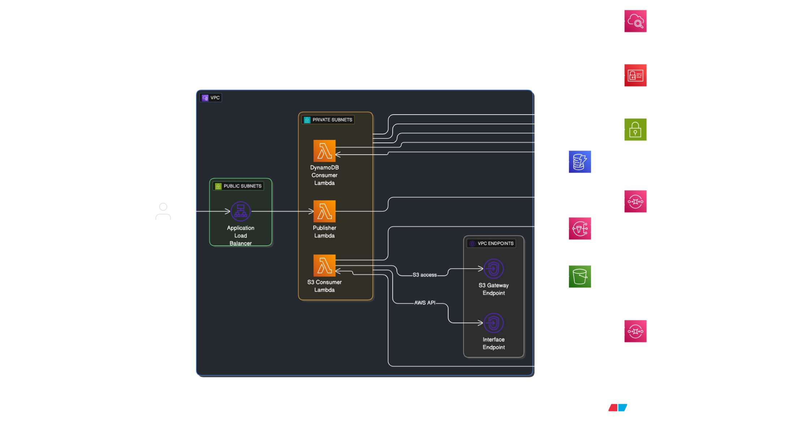

# Serverless Orders Pipeline on AWS

A detailed write-up of this project, including IAM policies, design decisions, and learnings, is published here: [Dev.to Blog Post](https://dev.to/ajithmanmu/hands-on-with-aws-building-and-securing-a-3-tier-web-app-1fjb).

---

## Overview

This project demonstrates a **serverless, event-driven architecture** on AWS that implements the **SNS → SQS fan-out pattern**. Orders are submitted via an Application Load Balancer (ALB) and routed to a Publisher Lambda, which validates requests and publishes them to an SNS topic. The SNS topic fans out events to multiple SQS queues, which are then consumed by dedicated Lambdas for downstream processing.

The project is built as a portfolio example to highlight Terraform-based infrastructure, IAM least privilege design, and secure VPC-connected serverless systems.

---

## Architecture

  

High-level flow:

1. **ALB (public)**
   Exposes `POST /orders` endpoint and routes requests to the Publisher Lambda.

2. **Publisher Lambda**
   Validates request headers (Client ID + Signature) and publishes order events to the SNS topic.

3. **SNS → SQS fan-out**
   `orders-topic` fans out to:

   * `orders-billing-q` → consumed by DynamoDB Lambda
   * `orders-archive-q` → consumed by S3 Lambda

4. **Consumer Lambdas (private VPC)**

   * DDB Consumer: persists order records into DynamoDB.
   * S3 Consumer: archives raw order payloads into S3.

5. **Supporting Infrastructure**

   * VPC with public (ALB) and private (Lambda) subnets.
   * VPC Endpoints for S3, DynamoDB, SNS, SQS, CloudWatch Logs.
   * CloudWatch Logs and alarms on queues, Lambdas, and ALB.


---

## Repository Structure

```
infra/
  ├─ network/        # VPC, subnets, route tables, SGs, endpoints
  ├─ data/           # DynamoDB table + S3 archive bucket
  ├─ messaging/      # SNS topic, SQS queues, DLQs, policies
  ├─ iam/            # Lambda execution roles + inline policies
  ├─ compute/        # Lambda functions (publisher + consumers) + event source mappings
  ├─ frontend/       # ALB, target group, listener rules
  ├─ observability/  # CloudWatch alarms for SQS/Lambda/ALB
lambdas/
  ├─ the_publisher/
  ├─ ddb_consumer/
  └─ the_s3_archive_consumer/
```

---

## Deployment

Terraform is organized into modular folders. Apply them in this order:
`network/` → `data/` → `messaging/` → `iam/` → `compute/` → `frontend/` → `observability/`

---

## Testing

After deployment, you can test with a simple `curl` command:

```bash
curl -i -X POST "http://<ALB_DNS>/orders" \
  -H "Content-Type: application/json" \
  -H "X-Client-Id: demo-client-id" \
  -H "X-Signature: demo-client-secret" \
  -d '{"orderId":"demo-001","items":[{"sku":"abc","qty":1}]}'
```

## Demo

https://www.loom.com/share/d1e6ba447fdd4edf8bcabe1b59703de1?sid=2525df44-cb27-45e9-9cc8-fbd1832a3ec1
